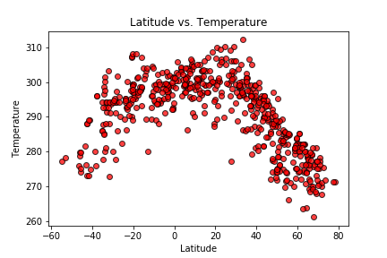
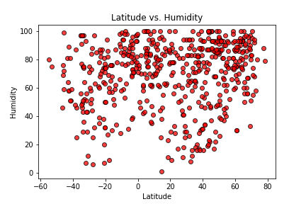
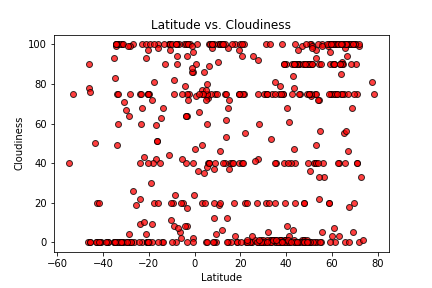
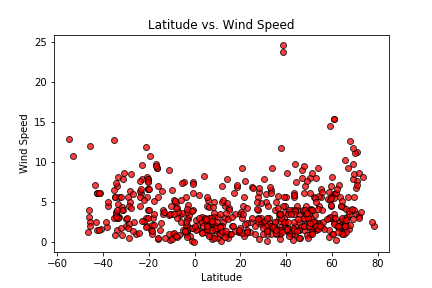

#### Wrote a Python script to visualize the weather of 500+ cities across the world of varying distance from the equator. Used a [simple Python library](https://pypi.python.org/pypi/citipy) and the [OpenWeatherMap API](https://openweathermap.org/api).

[My Open WeatherMap WebSite](https://shaleshk.github.io/OpenWeatherAPI-website/Home.html)

#### You may need to refresh the Home and Comparison pages.

